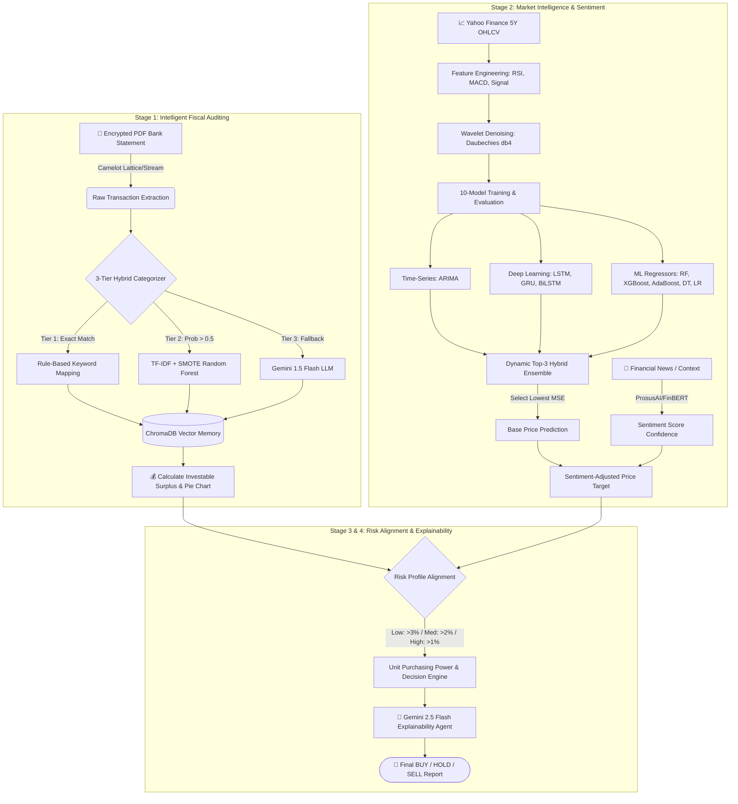

<div align="center">

# 🧠 Multi-Agent Financial Intelligence System
**Bridging Global Market Intelligence with Personal Fiscal Reality via LangGraph, Deep Learning, and LLMs**

[](https://www.python.org/)
[](https://github.com/langchain-ai/langgraph)
[](https://www.tensorflow.org/)
[](https://scikit-learn.org/)
[](https://deepmind.google/technologies/gemini/)
[](https://huggingface.co/ProsusAI/finbert)

</div>

---

## 📌 Project Overview

Effective investment management is heavily hindered by the disconnect between **global market intelligence** and **personal fiscal reality**. Traditional quantitative frameworks focus purely on market-centric price action while remaining blind to an investor's personal liquidity, spending habits, and risk thresholds.

The **Multi-Agent Financial Intelligence System** is an end-to-end personalized investment advisory pipeline[cite: 2, 5]. Coordinated through a stateful **LangGraph** architecture, the system ingests encrypted personal bank statements to calculate real-time investable surplus, evaluates 5 years of historical equity data across a **10-model ML/DL ensemble** enhanced with Wavelet denoising, adjusts price targets via **FinBERT** market sentiment, and synthesizes human-readable **BUY / HOLD / SELL** recommendations with exact unit affordability using **Google Gemini**[cite: 2, 6].

---

## 🏗️ System Architecture



---

## 🔬 Deep-Dive Module Breakdown

### 1️⃣ Stage 1: Intelligent Fiscal Auditing (`auditor.py` & `agents.py`)
Parses encrypted PDF bank statements using `camelot` (employing `lattice` mode with an automatic fallback to `stream` mode)[cite: 2]. Transactions are cleaned and routed through a **3-Tier Hybrid Categorizer** (`HybridCategorizer`) into six core buckets (`Grocery`, `Food`, `Transport`, `Bills`, `Healthcare`, `Miscellaneous`)[cite: 2, 3]:
* **Tier 1 (Domain Keyword Heuristics):** Instantaneous rule-based matching for high-frequency merchants (e.g., *Swiggy, Zomato, Uber, Zepto, Zerodha, Airtel*)[cite: 3].
* **Tier 2 (Machine Learning Pipeline):** Text is vectorized via `TfidfVectorizer`, class imbalances are resolved using `SMOTE` ($k=2$), and predictions are generated by a balanced `RandomForestClassifier` (`n_estimators=200`)[cite: 3]. Predictions with $>0.5$ probability confidence are accepted[cite: 3].
* **Tier 3 (LLM Zero-Shot Fallback):** Ambiguous transaction strings fall back to **Gemini 1.5 Flash** (`temperature=0.1`) for contextual classification[cite: 3].
* **Output & Memory:** Generates a formatted expenditure report table, renders a `matplotlib` expense distribution pie chart, stores transaction history in **ChromaDB** (`./finance_memory`), and outputs the user's net **Investable Surplus** ($\text{Total Deposits} - \text{Total Withdrawals}$)[cite: 2, 3].

### 2️⃣ Stage 2: 10-Model Market Intelligence (`ml_models.py`)
Fetches 5 years of historical stock data via `yfinance` and applies signal processing and technical feature engineering[cite: 6]:
* **Technical Indicators:** Computes Relative Strength Index (**RSI**), Moving Average Convergence Divergence (**MACD**), and **MACD Signal** using the `ta` library[cite: 6].
* **Signal Denoising:** Applies Discrete Wavelet Transform (**DWT**) using the **Daubechies 4 (`db4`)** wavelet at level 2 with soft thresholding (`value=0.5`) via `pywt` to strip high-frequency market noise from closing prices while preserving structural trends[cite: 6].
* **The 10-Model Arena (80/20 Train-Test Split)[cite: 6]:**
  1. **ARIMA `(5,1,0)`:** Rolling-window autoregressive forecasting[cite: 6].
  2. **LSTM:** 50-unit Long Short-Term Memory network with a 10-day lookback window across 4 scaled features (`Denoised_Close`, `RSI`, `MACD`, `MACD_Signal`)[cite: 6].
  3. **GRU:** Gated Recurrent Unit architecture[cite: 6].
  4. **BiLSTM:** Bidirectional LSTM capturing forward and backward temporal dependencies[cite: 6].
  5. **Random Forest Regressor:** 50-estimator ensemble tree model[cite: 6].
  6. **XGBoost Regressor:** Gradient boosted decision trees (`n_estimators=50`)[cite: 6].
  7. **AdaBoost Regressor:** Adaptive boosting regressor (`n_estimators=50`)[cite: 6].
  8. **Decision Tree Regressor:** Baseline non-linear tree[cite: 6].
  9. **Linear Regression:** Baseline ordinary least squares model[cite: 6].
  10. **Dynamic Top-3 Hybrid Ensemble:** Automatically ranks all models by **Mean Squared Error (MSE)**, selects the top 3 performers, and averages their predictions[cite: 6].

### 3️⃣ Stage 2.5: FinBERT Sentiment Modulation (`agents.py`)
Integrates prevailing market sentiment using HuggingFace's `ProsusAI/finbert` pipeline[cite: 2]. The base ML price prediction is dynamically modulated by the sentiment confidence score ($S \in [-1, 1]$)[cite: 2]:

$$\text{Predicted Price}_{\text{final}} = \text{Predicted Price}_{\text{base}} \times (1 + 0.02 \times S)$$

### 4️⃣ Stage 3 & 4: Risk Alignment & Gemini Explainability (`agents.py`)
Aligns quantitative growth projections with the user's capital constraints and risk appetite[cite: 2]:
* **Risk Threshold Mapping:** Maps user tolerance to minimum required expected growth: **Low Risk** ($>3.0\%$), **Medium Risk** ($>2.0\%$), **High Risk** ($>1.0\%$)[cite: 2].
* **Capital Allocation Math:** Calculates exact unit affordability based on the current stock price and available surplus[cite: 2]:

$$\text{Affordable Units} = \left\lfloor \frac{\text{Investable Surplus}}{\text{Current Stock Price}} \right\rfloor$$

* **Explainable AI (XAI):** **Gemini 2.5 Flash** (`temperature=0.3`) synthesizes all state variables—surplus, winning ML algorithm, FinBERT sentiment shift, risk threshold, and unit math—into a 3–4 bullet executive justification[cite: 2].

---

## 📊 Performance Benchmarks

Evaluated using **Mean Squared Error (MSE)**, **Mean Absolute Error (MAE)**, and **R-squared ($R^2$)**[cite: 6]:

| Model Architecture | Role in Pipeline | Evaluation Metrics & Strengths |
| :--- | :--- | :--- |
| **ARIMA (5,1,0)** | Baseline Statistical Benchmark | Highest baseline performance (`R² = 0.9836`, `MSE = 13.5698`)[cite: 6] |
| **Top-3 Hybrid Ensemble** | Ensemble Stabilizer | Combines top 3 lowest-MSE models (`R² = 0.9834`, `MSE = 13.7262`)[cite: 6] |
| **Deep Learning (LSTM / BiLSTM / GRU)** | Temporal Sequence Modeling | Captures non-linear multi-indicator interactions across 10-day lookbacks[cite: 6] |
| **Tree Ensembles (RF / XGBoost / AdaBoost)** | Tabular Feature Regression | Robust against outliers in flattened lag + indicator feature spaces[cite: 6] |

---

## 📂 Repository Structure

```text
├── agents.py                        # LangGraph state machine, node definitions, FiscalAgent & Gemini XAI
├── auditor.py                       # 3-Tier HybridCategorizer (Keyword + TF-IDF/SMOTE/RF + Gemini Fallback)
├── ml_models.py                     # 5Y yfinance pipeline, Wavelet (db4) denoising, 10-model training & evaluation
├── evaluation.py                    # Standalone validation scripts for Categorizer & LSTM RMSE metrics
├── main.py                          # Application entry point and initial FinancialState configuration
├── Personal_Finance_Dataset.csv     # Labeled training dataset for transaction categorization
├── requirements.txt                 # Python dependencies
└── .env                             # Environment variables (API Keys & PDF credentials)
```

---

## ⚙️ Installation & Setup

### 1. System Prerequisites
`camelot` requires **Ghostscript** and **Tkinter** to parse PDF tables[cite: 2].
* **Ubuntu/Debian:** `sudo apt-get install ghostscript python3-tk`
* **macOS:** `brew install ghostscript tcl-tk`
* **Windows:** Install the official [Ghostscript installer](https://ghostscript.com/releases/gsdnld.html) and add it to your system `PATH`.

### 2. Clone & Install Python Dependencies
```bash
git clone [https://github.com/your-username/multi-agent-financial-intelligence.git](https://github.com/your-username/multi-agent-financial-intelligence.git)
cd multi-agent-financial-intelligence
pip install -r requirements.txt
pip install camelot-py[cv] imbalanced-learn pywavelets ta xgboost statsmodels matplotlib joblib transformers
```

### 3. Configure Environment Variables
Populate your `.env` file in the root directory[cite: 1, 2]:
```env
GOOGLE_API_KEY="your_google_gemini_api_key"
TAVILY_API_KEY="your_tavily_api_key"
OPENAI_API_KEY="your_openai_api_key"
BANK_STATEMENT_PATH="path/to/your/bank_statement.pdf"
BANK_STATEMENT_PASSWORD="your_pdf_password"
```

---

## 🚀 Usage

### Run the Complete Multi-Agent Pipeline
Configure your target stock ticker and PDF credentials in `main.py`, then execute[cite: 5]:
```bash
python main.py
```

### Run Standalone Model Evaluations
To independently benchmark the TF-IDF/Random Forest Categorizer classification report and simulated LSTM RMSE metrics[cite: 4]:
```bash
python evaluation.py
```

---

## 🖥️ Sample Terminal Output

```text
================================================================================
 FINAL RECOMMENDATION: BUY AAPL
================================================================================
 [NUMERIC BREAKDOWN]
 • Current Stock Price             : ₹214.50
 • Base ML Prediction (ARIMA       ) : ₹220.10
 • FinBERT Sentiment Confidence    :  0.8421 (BULLISH)
 • Final Adjusted Prediction       : ₹223.81 (+4.34% Expected Growth)
 • Required Growth for Medium Risk :  +2.00%
 • Available Investable Surplus    : ₹18,450.00
 • Purchasing Power                : 86 Units
 • Recommended Action              : BUY 86 Units (Costing ₹18447.00)
================================================================================

[AI EXPLAINABILITY JUSTIFICATION]
* Quantitative Signal: ARIMA achieved the lowest validation MSE among all 10 models, projecting a baseline rise from ₹214.50 to ₹220.10.
* Sentiment Amplification: Bullish FinBERT sentiment (0.8421 confidence) adjusted the target to ₹223.81, representing a +4.34% expected return that clears your Medium Risk threshold (+2.00%).
* Capital Allocation: Based on your audited net surplus of ₹18,450.00, the system recommends purchasing 86 units for a total outlay of ₹18,447.00, leaving ₹3.00 in unallocated liquidity.
================================================================================
```
